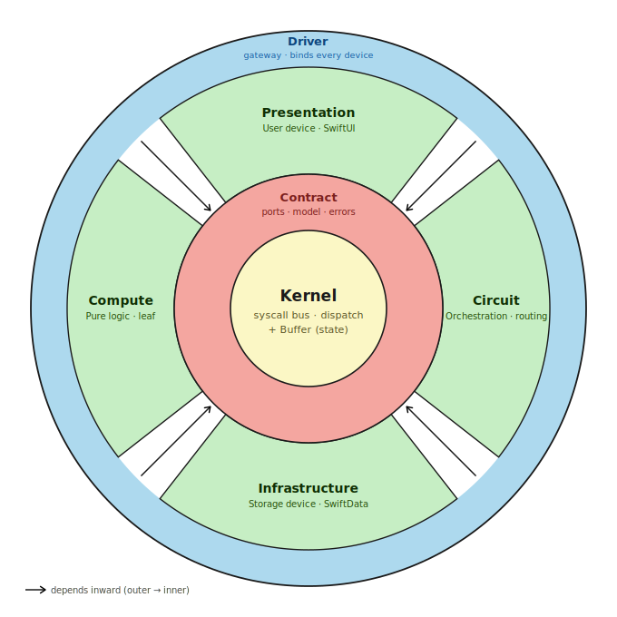

# ConcentricArch

<p align="center">
  
</p>

> A SwiftUI / SwiftData app architecture that treats control as **data (messages)**
> rather than a call hierarchy, and folds a return-less, one-way loop into concentric circles.

---

## 1. What is this

This isn't a clean architecture that merely inverts the *direction of dependencies*. It also lines up the **runtime flow of messages in that same direction**, forming a one-way-loop concentric architecture. Three mental models hold it up:

- **OS** — every application layer is positioned as a **Device**. The central `Kernel` routes messages, and `Presentation` / `Compute` / `Circuit` / `Infrastructure` are equal devices (services) hanging off the bus. Not a stack of layers, but peers with no edges between them.
- **UNIX pipe** — each stage's `Return` becomes the next stage's `Payload`, moving **forward and forward**. There is no deep dive-and-return path (bubbling); `compose` / `run` simply stream left to right.
- **React / Redux** — destinations that must be resolved dynamically are reached by **subscribing** to the shared memory `kernel.buffer` (a single source of truth). Circuit writes; Presentation observes.

The central `Kernel` does only two things: **send messages** and **manage shared memory**.

> **What is actually guaranteed — stated plainly.** Two different things are enforced at two different times, and it helps not to conflate them:
>
> - **Module dependencies are static.** The compiler enforces the inward direction: a target can only `import` what is listed in its `dependencies` ([`Package.swift`](Package.swift)), so no device can reach another and nothing reaches outward. `Kernel` is a leaf; `concentric-arch` (App) is the only root.
> - **Execution is mediated, and only its *types* are static.** Every cross-device call is erased into a `Symbol<Payload, Output>` dispatched through the injected `Kernel` bus. The phantom types — plus the `Pipe` constraint "previous `Return` == next `Payload`" — pin the payload and result at compile time, but *which* handler answers a symbol is resolved at runtime. An unwired symbol is a `KernelError.unbound` thrown at the call, not a compile error.
>
> So this is **not dependency inversion** in the classic sense — no high→low arrow is flipped through an interface, because there is no such arrow to begin with. The dependency is dissolved into a `Symbol` and mediated by a centrally injected bus; the concrete bindings are wired at the composition root (`App` / `Driver`). The injected kernel is the whole trick.
>
> And that is exactly why it reads as a **type-bound `goto`**: a call jumps to a symbol the way `goto` jumps to a label — resolved late, possibly `unbound` — yet the `Symbol`'s phantom types keep the payload and result type-checked across the jump.

## 2. What it gives you

- It makes **control visible as data**. In the old style — diving deep and bubbling back up through tangled dependencies — the control flow was hard to follow. Here it becomes a **single declaration**: `pipeline(...).tap(...).map(...).effect(...)`.
- It folds the destination into a typed token, **`Symbol`**. You load a payload onto a `Symbol<Payload, Output>` and throw it — a type-safe way to express *the work you want to advance to next*.
- For destinations you can't wire statically, components **subscribe** to the shared memory **`kernel.buffer`** (the same idea as a Redux store).
- The result is a **collection of in-app microservices** — or, seen another way, an architecture that leans heavily on a **type-bound `goto`**.

## 3. Layer structure

`Domain` was originally meant to sit at the center. What actually landed there was the **`Kernel`** (message dispatch + shared-memory management), and `Domain` dissolved — its **business rules melted into `Circuit`, its business logic into `Compute`**.

| Ring | Module | Role |
|---|---|---|
| **Center — Kernel** | `Kernel` | Sends messages (`call` / `dispatch` / `compose` / `run`) and manages the shared memory `buffer`. A leaf. |
| **Contract** | `Contract` | The shared vocabulary — ports (`Symbol` declarations), model (entities / DTOs), errors. |
| Device — **Presentation** | `Presentation` | The user device (SwiftUI). Subscribes to `buffer` and `dispatch`es. |
| Device — **Circuit** | `Circuit` | Orchestration (wiring). Drives pipelines with `run`. Holds **rules**, not logic. |
| Device — **Compute** | `Compute` | The compute device. Pure logic (no I/O, no kernel calls), a leaf. |
| Device — **Infrastructure** | `Infrastructure` | The storage device. Repositories / SwiftData `@Model`. |
| **Driver** | `Driver` | The gateway. The single point that binds ports (`Symbol`s) to concrete devices. |

> Not drawn in the diagram, but just outside the outermost ring lives `App` (`@main`) — the **source node** that wires every Driver into the Kernel. `App` and the external hardware (screen, disk) are universal to any architecture, so the diagram leaves them out.

## Influences

No invention is claimed. "Control as data" isn't a new wish — it's a lineage that has always treated **control as something you can see and wire**, and this design just follows it into a typed Swift app:

- **Node-graph dataflow — Scratch, ComfyUI, redstone.** Here computation *is* the wiring. Scratch's "broadcast and receive" is exactly this `buffer`: a message sent with no return, picked up by whoever subscribes. ComfyUI is `pipeline(...).pipe(...).map(...)` drawn as nodes; a redstone circuit is forward-only signal through wired devices. These traditions are usually dynamic and untyped — the one move here is to keep that wiring sensibility but bind it with Swift's phantom types (hence the **type-bound `goto`**).
- **UNIX pipelines.** Taken literally as the `Verb` / `Pipe` forward drive: a stage's `Return` is the next stage's `Payload`, streaming left to right.
- **React / Redux** (five years of it). The `buffer` is the store, `dispatch` and subscription are the loop, the data flows one way.

If there is a contribution, it's the synthesis: making these coherent under a single OS metaphor, with the dispatching kernel — not the domain — at the center.

---

## Message drive modes

There are four ways to send into the `Kernel`. Choose by **whether there is a return path**.

| API | Return path | Use | On failure |
|---|---|---|---|
| `kernel.call(symbol, payload) -> O` | yes | A one-off query that needs a value (i.e. a one-stage pipe). | `throws` |
| `kernel.compose(pipe, payload) -> O` | yes | A value-returning pipeline. The `.abort` / `.divert` value becomes the result. *Reserved: no production caller at present — kept for synchronous needs (e.g. MCP-style tools) and as the engine behind `.divert`.* | `throws` |
| `kernel.dispatch(symbol, payload)` | **none** (fire-and-forget) | **Presentation's main entry point.** Enqueues on the serial bus and returns immediately — no `await`, no return value, no `throws`. | Routed to `buffer` (`AppErrorState`) via `errorSink` |
| `kernel.run(pipe, payload)` | **none** (forward-only) | **Circuit's commands.** Discards the final value; results are published into `buffer` through `.tap` / `.effect`. | `throws` (caught by the caller — `dispatch`) |

Typical path: `Presentation.dispatch` → the Kernel `call`s through the serial bus → a Circuit handler streams forward with `kernel.run(pipe)` → an `effect` updates the `buffer` → Presentation re-renders from its subscription. The point is that **nothing is returned by value.**

> **Forward-only ≠ no `await`.** "Forward-only" is about *control*: there is no return path — a stage's result flows on to the next stage or is published to the `buffer`, never bubbled back to the caller. The `await` inside a pipeline is about *time*: each data-dependent stage waits for the previous one to finish before stepping forward (the I/O is genuinely async). The direction stays forward; `await` just paces the stride. Even a `.fail` doesn't travel back up — it exits sideways into the `buffer` at the `dispatch` boundary.

## Pipe control words — Verb

Each stage returns a `Verb<Forward>` instead of a bare value (modeling the UNIX pipe's "write to stdout and keep flowing"). Only `.next` feeds a downstream stage, so **only `.next` has a pinned type**. The other three are terminators whose value stays `Any` and is cast once, at the boundary.

| Verb | Meaning | Forward type |
|---|---|---|
| `.next(Forward)` | Continue. `Forward` becomes the next stage's `Payload`. | pinned |
| `.abort(Any)` | Normal early termination. This value is the pipe's result. | terminal (`Any`) |
| `.divert(Diversion)` | Drop the remaining stages and run another pipe, making its result the pipe's result. | terminal (`Any`) |
| `.fail(Error)` | Abnormal termination. `throw`s out of `compose` / `run`. | terminal |

Under `run` (forward-only), `.abort` / `.divert` simply mean "stop here" — there is no value to return.

## Pipe connectors

Start with `pipeline(...)` and chain left to right. Each connector's type enforces, **at compile time**, that "the previous stage's `Return` == the next stage's `Payload`."

| Connector | What it does | Value flow |
|---|---|---|
| `pipeline(symbol)` / `pipeline(stage)` | The entry point. Begin with a leading `Symbol`, or a verb-returning stage. | establishes the start |
| `.pipe(symbol)` | Call the next `Symbol`. Its bound handler's verb drives the pipe directly. | `Cursor → Next` |
| `.pipe(symbol) { adapt }` | Build the `Payload` from the flowing value, then pass it to the next symbol. | `Cursor → Next` |
| `.pipe { kernel, value in ... }` | A self-describing rule stage that returns a verb. It receives the kernel (so it can `call`) and decides `.next/.abort/.divert/.fail` itself. | `Cursor → Next` |
| **`.tap(symbol)`** | Run a side-effecting `Symbol` (`-> Void`) and **keep the original value flowing** (a tee). Lets a persist step read as one link in the chain; a `.fail` stops the pipe. | `Cursor → Cursor` |
| **`.map(transform)`** | A pure, synchronous transform (no I/O, no kernel calls) — a projection, e.g. mapping to a DTO. | `Cursor → Next` |
| **`.effect(run)`** | A side-effecting passthrough (e.g. a `buffer` write). Runs, then **keeps the same value flowing**. | `Cursor → Cursor` |
| `.seal()` | Freeze the builder into a `Pipe`, ready for `run` / `compose`. | — |

### Example

The body of `Circuit.Slideshow.create` (`Sources/Circuit/Slideshow/CreateSlideshow.swift`). "Create → save → project → publish to the buffer" reads as a single declaration.

```swift
// Pipeline: Compute.Slideshow.create ▶ Infrastructure.Library.save ▶ buffer.append
package func createSlideshow(_ kernel: Kernel, _ payload: CreateSlideshowPayload) async throws {
    try await kernel.run(
        pipeline(Compute.Slideshow.create)        // CreateSlideshowPayload -> Slideshow   (Compute: pure logic)
            .tap(Infrastructure.Library.save)     // persist, keep the Slideshow flowing     (Infrastructure: I/O)
            .map(SlideshowReturn.init(from:))      // project to a DTO                        (pure transform)
            .effect { kernel, created in           // publish to the buffer (in lieu of a return path)
                await kernel.buffer.mutate(LibraryState.self) { $0.slideshows.append(created) }
            },
        payload
    )
}
```

Presentation never waits for a value — it just throws a message and subscribes:

```swift
// Sources/Presentation/Library/SlideshowLibraryViewModel.swift
var slideshows: [SlideshowReturn] { kernel.buffer.read(LibraryState.self).slideshows }  // subscribe
func reload() { kernel.dispatch(Circuit.Slideshow.fetchAll, FetchSlideshowsPayload()) } // fire and forget
```

---

## Build & run

```sh
swift build                 # build
swift test                  # tests for the Kernel's compose pipeline
./Scripts/build.sh          # bundle into concentric-arch.app for distribution
```

## License

[MIT](LICENSE) © s-age
